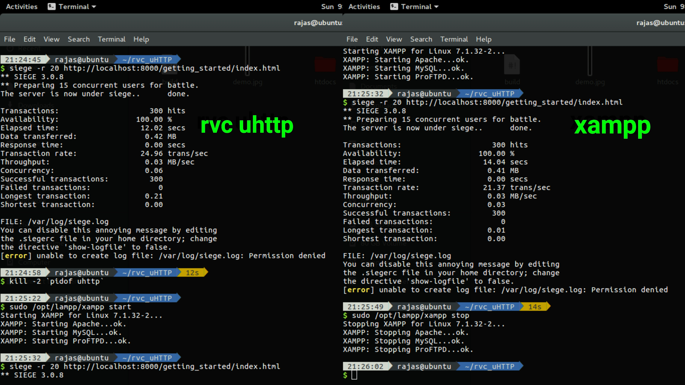

# Rvc uHTTP Server

A 'Micro' HTTP server written from scratch in C

Features:
1) Basic MIME mapping
2) Basic directory listing
3) Low resource usage
4) Support Accept-Ranges: bytes (for in browser MP4 playing)
5) Concurrency by self scaling

## Getting Started

These instructions will get you a copy of the project up and running on your local machine for development and testing purposes. See deployment for notes on how to deploy the project on a live system.

### Prerequisites

This project is built on Ubuntu 16.04 LTS so
the release for this project can work on any 64 bit Debian distributions.
However we are planning to create a configuration for Windows in further releases
This server compiles with built in 'cc' c compiler.

### Compilation

It has a build script so in terminal so just run

```
chmod +x build
./build
```
This will create a 'uhttp' server binary and immediately launch a getting_started site in htdocs in the firefox browser

## Deployment

run
```
./uhttp [port no]
```
To start the http server at port no 'port no'.
If no arguments are given the server starts at port 8000.

## Author

* **Rajas Chavadekar** 

## License

This project is licensed under the MIT License - see the [LICENSE](LICENSE) file for details

### Stress test on actual network


### A sample runtime to demonstrate 

